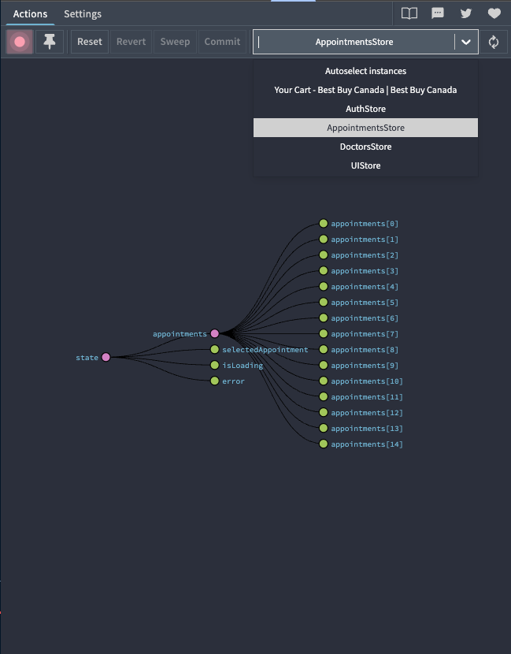
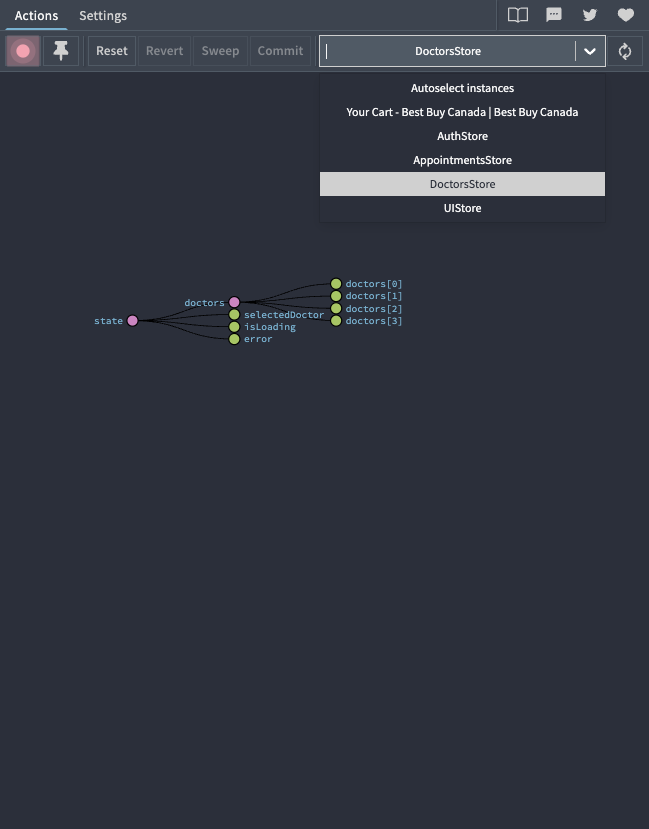
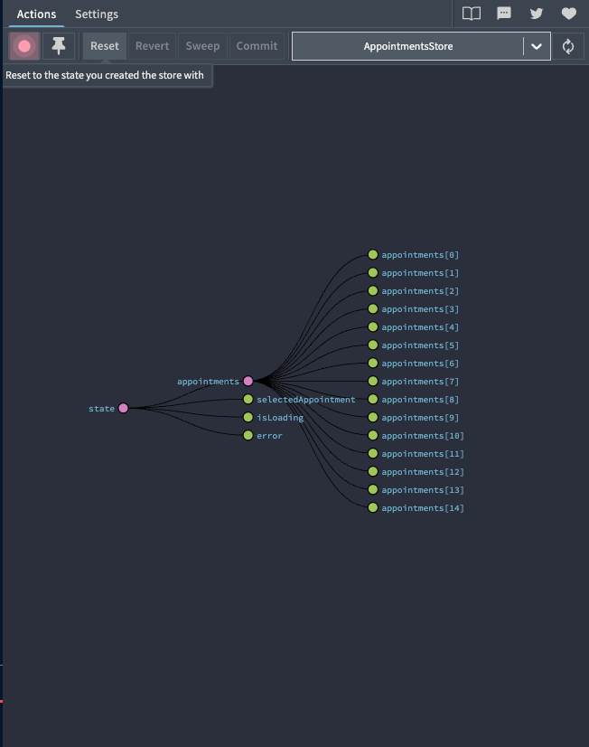
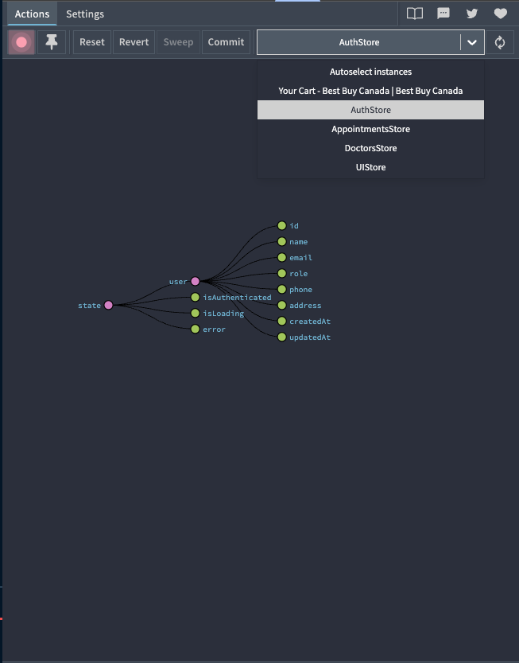

# Zustand State Management Guide

Complete guide for using Zustand in the Calnic application.

## Table of Contents

1. [Introduction](#introduction)
2. [Installation](#installation)
3. [Store Structure](#store-structure)
4. [Creating a New Store](#creating-a-new-store)
5. [Using Stores in Components](#using-stores-in-components)
6. [Adding State](#adding-state)
7. [Updating State](#updating-state)
8. [Deleting Data](#deleting-data)
9. [Selectors and Computed Values](#selectors-and-computed-values)
10. [Middleware](#middleware)
11. [Redux DevTools](#redux-devtools)
12. [Best Practices](#best-practices)
13. [Common Patterns](#common-patterns)

---

## Introduction

Zustand is a small, fast, and scalable state management solution. It uses a simplified flux principles approach and doesn't require wrapping your app in context providers.

**Key Benefits:**

- No boilerplate code
- No context providers needed
- Works with React hooks
- TypeScript support (when needed)
- DevTools integration
- Middleware support

---

## Installation

Zustand is already installed in this project:

```bash
pnpm install zustand
```

---

## Store Structure

All stores are located in the `/store` directory:

```
store/
├── authStore.js           # User authentication
├── appointmentsStore.js   # Appointments management
├── doctorsStore.js        # Doctors data
├── uiStore.js            # UI state (modals, theme, etc.)
└── index.js              # Central export
```

---

## Creating a New Store

### Basic Store Template

```javascript
import { create } from 'zustand';
import { devtools } from 'zustand/middleware';

const useMyStore = create(
  devtools(
    (set, get) => ({
      // State
      items: [],
      selectedItem: null,
      isLoading: false,

      // Actions
      setItems: (items) => {
        set({ items }, false, 'myStore/setItems');
      },

      addItem: (item) => {
        set(
          (state) => ({
            items: [...state.items, item]
          }),
          false,
          'myStore/addItem'
        );
      },

      updateItem: (id, updates) => {
        set(
          (state) => ({
            items: state.items.map((item) => (item.id === id ? { ...item, ...updates } : item))
          }),
          false,
          'myStore/updateItem'
        );
      },

      deleteItem: (id) => {
        set(
          (state) => ({
            items: state.items.filter((item) => item.id !== id)
          }),
          false,
          'myStore/deleteItem'
        );
      },

      // Selectors
      getItemById: (id) => {
        return get().items.find((item) => item.id === id);
      }
    }),
    {
      name: 'MyStore', // DevTools name
      enabled: process.env.NODE_ENV === 'development'
    }
  )
);

export default useMyStore;
```

### Store with Persistence

Use the `persist` middleware to save state to localStorage:

```javascript
import { create } from 'zustand';
import { devtools, persist } from 'zustand/middleware';

const useMyStore = create(
  devtools(
    persist(
      (set, get) => ({
        // State and actions here
        user: null,
        theme: 'light',

        setUser: (user) => {
          set({ user }, false, 'myStore/setUser');
        }
      }),
      {
        name: 'my-storage', // localStorage key
        partialize: (state) => ({
          user: state.user,
          theme: state.theme
        }) // Only persist these fields
      }
    ),
    {
      name: 'MyStore',
      enabled: process.env.NODE_ENV === 'development'
    }
  )
);

export default useMyStore;
```

---

## Using Stores in Components

### Import the Store

```javascript
import { useAuthStore, useAppointmentsStore } from '../store';
```

### Select Specific State and Actions

```javascript
function MyComponent() {
  // Select only what you need (prevents unnecessary re-renders)
  const { user, login, logout } = useAuthStore();
  const { appointments, addAppointment } = useAppointmentsStore();

  // Use in your component
  return (
    <div>
      <p>Welcome, {user?.name}</p>
      <button onClick={logout}>Logout</button>
    </div>
  );
}
```

### Using Selectors for Performance

```javascript
function MyComponent() {
  // Only re-render when this specific value changes
  const user = useAuthStore((state) => state.user);
  const appointmentCount = useAppointmentsStore((state) => state.appointments.length);

  return (
    <div>
      <p>User: {user?.name}</p>
      <p>Total Appointments: {appointmentCount}</p>
    </div>
  );
}
```

### Using Multiple Stores

```javascript
function Dashboard() {
  const { user, logout } = useAuthStore();
  const { appointments, addAppointment, deleteAppointment } = useAppointmentsStore();
  const { doctors, updateDoctorStatus } = useDoctorsStore();
  const { calendarView, setCalendarView, navigateCalendar } = useUIStore();

  // Use all stores together
}
```

---

## Adding State

### Adding New State Properties

1. Add the state to your store:

```javascript
const useMyStore = create(
  devtools(
    (set, get) => ({
      // Existing state
      items: [],

      // NEW: Add new state property
      filter: 'all',
      sortBy: 'name'

      // Actions remain the same
    }),
    { name: 'MyStore' }
  )
);
```

2. Create actions to modify it:

```javascript
// Inside the store
setFilter: (filter) => {
    set({ filter }, false, 'myStore/setFilter');
},

setSortBy: (sortBy) => {
    set({ sortBy }, false, 'myStore/setSortBy');
},
```

3. Use in components:

```javascript
function FilterComponent() {
  const { filter, setFilter, sortBy, setSortBy } = useMyStore();

  return (
    <div>
      <select value={filter} onChange={(e) => setFilter(e.target.value)}>
        <option value="all">All</option>
        <option value="active">Active</option>
      </select>
    </div>
  );
}
```

---

## Updating State

### Simple Update (Replace Value)

```javascript
// In store
setTheme: (theme) => {
    set({ theme }, false, 'ui/setTheme');
},

// In component
const { setTheme } = useUIStore();
setTheme('dark');
```

### Update Based on Previous State

```javascript
// In store
incrementCounter: () => {
    set(
        (state) => ({ counter: state.counter + 1 }),
        false,
        'myStore/incrementCounter'
    );
},

toggleTheme: () => {
    set(
        (state) => ({ theme: state.theme === 'light' ? 'dark' : 'light' }),
        false,
        'ui/toggleTheme'
    );
},
```

### Update Array Items

```javascript
// Update item in array
updateAppointment: (id, updates) => {
    set(
        (state) => ({
            appointments: state.appointments.map((apt) =>
                apt.id === id ? { ...apt, ...updates } : apt
            ),
        }),
        false,
        'appointments/updateAppointment'
    );
},

// Usage in component
const { updateAppointment } = useAppointmentsStore();

updateAppointment(appointmentId, {
    patientName: 'John Doe',
    doctorName: 'Dr. Smith',
    start: new Date('2025-10-30T10:00:00'),
});
```

### Update Nested Objects

```javascript
// In store
updateUserProfile: (profileUpdates) => {
  set(
    (state) => ({
      user: {
        ...state.user,
        profile: {
          ...state.user.profile,
          ...profileUpdates
        }
      }
    }),
    false,
    'auth/updateUserProfile'
  );
},
  // Usage
  updateUserProfile({ age: 30, city: 'Calgary' });
```

### Multiple State Updates

```javascript
// Update multiple properties at once
set(
  {
    isLoading: false,
    error: null,
    data: responseData
  },
  false,
  'myStore/fetchSuccess'
);
```

---

## Deleting Data

### Remove Item from Array

```javascript
// In store
deleteAppointment: (id) => {
    set(
        (state) => ({
            appointments: state.appointments.filter((apt) => apt.id !== id),
        }),
        false,
        'appointments/deleteAppointment'
    );
},

// Usage
const { deleteAppointment } = useAppointmentsStore();
deleteAppointment(123);
```

### Clear All Data

```javascript
// In store
clearAppointments: () => {
    set({ appointments: [] }, false, 'appointments/clearAppointments');
},

reset: () => {
    set(
        {
            appointments: [],
            selectedAppointment: null,
            isLoading: false,
            error: null,
        },
        false,
        'appointments/reset'
    );
},
```

### Remove Property (Set to Null)

```javascript
// In store
clearSelectedItem: () => {
    set({ selectedItem: null }, false, 'myStore/clearSelectedItem');
},

clearError: () => {
    set({ error: null }, false, 'myStore/clearError');
},
```

---

## Selectors and Computed Values

### Store-Level Selectors

Define selectors inside your store for reusable queries:

```javascript
const useAppointmentsStore = create(
  devtools((set, get) => ({
    appointments: [],

    // Selectors
    getAppointmentById: (id) => {
      return get().appointments.find((apt) => apt.id === id);
    },

    getAppointmentsByDate: (date) => {
      const targetDate = dayjs(date).format('YYYY-MM-DD');
      return get().appointments.filter((apt) => {
        return dayjs(apt.start).format('YYYY-MM-DD') === targetDate;
      });
    },

    getTodayAppointments: () => {
      const today = dayjs().format('YYYY-MM-DD');
      return get().appointments.filter((apt) => {
        return apt.patientName && dayjs(apt.start).format('YYYY-MM-DD') === today;
      });
    },

    searchAppointments: (searchTerm) => {
      const term = searchTerm.toLowerCase();
      return get().appointments.filter(
        (apt) => apt.patientName?.toLowerCase().includes(term) || apt.doctorName?.toLowerCase().includes(term)
      );
    }
  }))
);
```

### Using Selectors in Components

```javascript
function TodayAppointments() {
  const getTodayAppointments = useAppointmentsStore((state) => state.getTodayAppointments);

  // Call the selector
  const todayAppointments = getTodayAppointments();

  return (
    <div>
      {todayAppointments.map((apt) => (
        <div key={apt.id}>{apt.patientName}</div>
      ))}
    </div>
  );
}
```

### Component-Level Selectors

```javascript
function MyComponent() {
  // Derive computed value from state
  const appointmentCount = useAppointmentsStore((state) => state.appointments.length);

  const hasAppointments = useAppointmentsStore((state) => state.appointments.length > 0);

  const activeAppointments = useAppointmentsStore((state) =>
    state.appointments.filter((apt) => apt.status === 'active')
  );

  return <div>Active: {activeAppointments.length}</div>;
}
```

---

## Middleware

### DevTools Middleware

Already configured in all stores. View state in Redux DevTools browser extension.

```javascript
import { devtools } from 'zustand/middleware';

const useMyStore = create(
  devtools(
    (set, get) => ({
      // your store
    }),
    {
      name: 'MyStore', // Name shown in DevTools
      enabled: process.env.NODE_ENV === 'development' // Only in dev
    }
  )
);
```

### Persist Middleware

Save state to localStorage:

```javascript
import { persist } from 'zustand/middleware';

const useMyStore = create(
  devtools(
    persist(
      (set, get) => ({
        user: null,
        theme: 'light'
      }),
      {
        name: 'my-storage', // localStorage key
        partialize: (state) => ({
          // Only persist these fields
          user: state.user,
          theme: state.theme
        })
      }
    ),
    { name: 'MyStore' }
  )
);
```

### Custom Middleware

Create custom middleware:

```javascript
const logMiddleware = (config) => (set, get, api) =>
  config(
    (...args) => {
      console.log('Previous state:', get());
      set(...args);
      console.log('New state:', get());
    },
    get,
    api
  );

const useMyStore = create(
  logMiddleware((set) => ({
    count: 0,
    increment: () => set((state) => ({ count: state.count + 1 }))
  }))
);
```

---

## Redux DevTools

### Installation

Install the Redux DevTools browser extension:

- **Chrome:** [Redux DevTools](https://chrome.google.com/webstore/detail/redux-devtools/lmhkpmbekcpmknklioeibfkpmmfibljd)
- **Firefox:** [Redux DevTools](https://addons.mozilla.org/en-US/firefox/addon/reduxdevtools/)

### Using DevTools

1. Open your browser's developer tools (F12)
2. Find the "Redux" tab
3. Select your store from the dropdown (e.g., "AuthStore", "AppointmentsStore")
4. View state changes in real-time

### DevTools Features

**View State:**

```
- See current state
- Inspect nested objects
- Track state history
```

**Time Travel:**

```
- Jump to previous states
- Replay actions
- Debug state changes
```

**Action Names:**
All actions in our stores use descriptive names:

```javascript
set({ user: data }, false, 'auth/login/success');
//                          ^^^^^^^^^^^^^^^^^^^
//                          Shows in DevTools
```

**Monitor Actions:**

- Click on any action to see before/after state
- Export state for debugging
- Import state for testing

---

## Best Practices

### 1. Keep Stores Focused

Each store should handle a specific domain:

```javascript
// Good
useAuthStore(); // Only authentication
useDoctorsStore(); // Only doctor data
useUIStore(); // Only UI state

// Bad
useGlobalStore(); // Everything mixed together
```

### 2. Use Descriptive Action Names

```javascript
// Good
set({ user }, false, 'auth/login/success');
set({ error }, false, 'appointments/fetchError');

// Bad
set({ user }, false, 'update');
set({ error }, false, 'error');
```

### 3. Avoid Storing Derived State

```javascript
// Bad - storing derived state
{
    appointments: [...],
    appointmentCount: 10,  // ❌ Can be derived
}

// Good - compute when needed
{
    appointments: [...],
    getAppointmentCount: () => get().appointments.length,  // ✅
}
```

### 4. Select Only What You Need

```javascript
// Good - only re-render when user changes
const user = useAuthStore((state) => state.user);

// Less optimal - re-renders on any auth store change
const { user } = useAuthStore();
```

### 5. Keep Actions Pure

```javascript
// Good - predictable side effects
addAppointment: (appointment) => {
    const newAppointment = {
        id: Date.now(),
        ...appointment,
    };
    set((state) => ({
        appointments: [...state.appointments, newAppointment],
    }));
    return newAppointment;
},

// Bad - unpredictable side effects
addAppointment: (appointment) => {
    console.log('Adding...'); // ❌ Side effect
    window.alert('Added!');   // ❌ Side effect
    set(...);
},
```

### 6. Use TypeScript for Type Safety (Optional)

```typescript
interface AuthState {
  user: User | null;
  isAuthenticated: boolean;
  login: (username: string, password: string) => Promise<void>;
  logout: () => void;
}

const useAuthStore = create<AuthState>()(
  devtools((set) => ({
    user: null,
    isAuthenticated: false,
    login: async (username, password) => {
      // implementation
    },
    logout: () => {
      set({ user: null, isAuthenticated: false });
    }
  }))
);
```

---

## Common Patterns

### Pattern 1: Async Actions

```javascript
// In store
fetchAppointments: async () => {
    set({ isLoading: true, error: null }, false, 'appointments/fetchStart');

    try {
        const response = await fetch('/api/appointments');
        const data = await response.json();

        set(
            {
                appointments: data,
                isLoading: false,
            },
            false,
            'appointments/fetchSuccess'
        );
    } catch (error) {
        set(
            {
                error: error.message,
                isLoading: false,
            },
            false,
            'appointments/fetchError'
        );
    }
},

// In component
const { fetchAppointments, isLoading, error } = useAppointmentsStore();

useEffect(() => {
    fetchAppointments();
}, [fetchAppointments]);

if (isLoading) return <div>Loading...</div>;
if (error) return <div>Error: {error}</div>;
```

### Pattern 2: Optimistic Updates

```javascript
// In store
deleteAppointment: async (id) => {
    // Store original data for rollback
    const originalAppointments = get().appointments;

    // Optimistically remove from UI
    set(
        (state) => ({
            appointments: state.appointments.filter((apt) => apt.id !== id),
        }),
        false,
        'appointments/deleteOptimistic'
    );

    try {
        await fetch(`/api/appointments/${id}`, { method: 'DELETE' });
    } catch (error) {
        // Rollback on error
        set(
            { appointments: originalAppointments, error: error.message },
            false,
            'appointments/deleteError'
        );
    }
},
```

### Pattern 3: Subscriptions

```javascript
// Subscribe to store changes outside React
const unsubscribe = useAuthStore.subscribe(
  (state) => state.user,
  (user) => {
    console.log('User changed:', user);
  }
);

// Clean up
unsubscribe();
```

### Pattern 4: Reset Store

```javascript
// In store
const initialState = {
  appointments: [],
  selectedAppointment: null,
  isLoading: false,
  error: null
};

const useAppointmentsStore = create(
  devtools((set) => ({
    ...initialState,

    // Actions...

    reset: () => {
      set(initialState, false, 'appointments/reset');
    }
  }))
);

// Usage
const { reset } = useAppointmentsStore();
reset(); // Reset to initial state
```

### Pattern 5: Accessing Store Outside Components

```javascript
// Get current state
const currentUser = useAuthStore.getState().user;

// Call actions
useAuthStore.getState().logout();

// Example: in utility file
export function getCurrentUser() {
  return useAuthStore.getState().user;
}
```

### Pattern 6: Combining Multiple Stores

```javascript
function BookingForm() {
  const { user } = useAuthStore();
  const { addAppointment } = useAppointmentsStore();
  const { doctors, getAvailableDoctors } = useDoctorsStore();
  const { closeBookingModal } = useUIStore();

  const handleSubmit = (data) => {
    const appointment = {
      ...data,
      userId: user.id
    };

    addAppointment(appointment);
    closeBookingModal();
  };

  const availableDoctors = getAvailableDoctors();
}
```

---

## Example: Complete Store Implementation

Here's a complete example of a patient store:

```javascript
import { create } from 'zustand';
import { devtools, persist } from 'zustand/middleware';

const usePatientsStore = create(
  devtools(
    persist(
      (set, get) => ({
        // State
        patients: [],
        selectedPatient: null,
        isLoading: false,
        error: null,
        filters: {
          searchTerm: '',
          status: 'all'
        },

        // CRUD Actions
        setPatients: (patients) => {
          set({ patients }, false, 'patients/setPatients');
        },

        addPatient: async (patientData) => {
          set({ isLoading: true }, false, 'patients/addStart');

          try {
            const response = await fetch('/api/patients', {
              method: 'POST',
              headers: { 'Content-Type': 'application/json' },
              body: JSON.stringify(patientData)
            });

            const newPatient = await response.json();

            set(
              (state) => ({
                patients: [...state.patients, newPatient],
                isLoading: false
              }),
              false,
              'patients/addSuccess'
            );

            return newPatient;
          } catch (error) {
            set(
              {
                error: error.message,
                isLoading: false
              },
              false,
              'patients/addError'
            );
            throw error;
          }
        },

        updatePatient: (id, updates) => {
          set(
            (state) => ({
              patients: state.patients.map((patient) => (patient.id === id ? { ...patient, ...updates } : patient))
            }),
            false,
            'patients/updatePatient'
          );
        },

        deletePatient: (id) => {
          set(
            (state) => ({
              patients: state.patients.filter((patient) => patient.id !== id)
            }),
            false,
            'patients/deletePatient'
          );
        },

        // Selection
        selectPatient: (patient) => {
          set({ selectedPatient: patient }, false, 'patients/selectPatient');
        },

        clearSelectedPatient: () => {
          set({ selectedPatient: null }, false, 'patients/clearSelectedPatient');
        },

        // Filters
        setSearchTerm: (searchTerm) => {
          set(
            (state) => ({
              filters: { ...state.filters, searchTerm }
            }),
            false,
            'patients/setSearchTerm'
          );
        },

        setStatusFilter: (status) => {
          set(
            (state) => ({
              filters: { ...state.filters, status }
            }),
            false,
            'patients/setStatusFilter'
          );
        },

        // Selectors
        getPatientById: (id) => {
          return get().patients.find((patient) => patient.id === id);
        },

        getFilteredPatients: () => {
          const { patients, filters } = get();
          let filtered = patients;

          // Apply search
          if (filters.searchTerm) {
            filtered = filtered.filter((patient) =>
              patient.name.toLowerCase().includes(filters.searchTerm.toLowerCase())
            );
          }

          // Apply status filter
          if (filters.status !== 'all') {
            filtered = filtered.filter((patient) => patient.status === filters.status);
          }

          return filtered;
        },

        // Reset
        reset: () => {
          set(
            {
              patients: [],
              selectedPatient: null,
              isLoading: false,
              error: null,
              filters: {
                searchTerm: '',
                status: 'all'
              }
            },
            false,
            'patients/reset'
          );
        }
      }),
      {
        name: 'patients-storage',
        partialize: (state) => ({
          patients: state.patients,
          filters: state.filters
        })
      }
    ),
    {
      name: 'PatientsStore',
      enabled: process.env.NODE_ENV === 'development'
    }
  )
);

export default usePatientsStore;
```

### Using the Patient Store:

```javascript
import usePatientsStore from '../store/patientsStore';

function PatientsList() {
  const { getFilteredPatients, selectPatient, deletePatient, filters, setSearchTerm, setStatusFilter } =
    usePatientsStore();

  const filteredPatients = getFilteredPatients();

  return (
    <div>
      <input
        type="text"
        value={filters.searchTerm}
        onChange={(e) => setSearchTerm(e.target.value)}
        placeholder="Search patients..."
      />

      <select value={filters.status} onChange={(e) => setStatusFilter(e.target.value)}>
        <option value="all">All</option>
        <option value="active">Active</option>
        <option value="inactive">Inactive</option>
      </select>

      {filteredPatients.map((patient) => (
        <div key={patient.id}>
          <h3>{patient.name}</h3>
          <button onClick={() => selectPatient(patient)}>View</button>
          <button onClick={() => deletePatient(patient.id)}>Delete</button>
        </div>
      ))}
    </div>
  );
}
```

---

## Troubleshooting

### Store not updating in component

Make sure you're using the store as a hook:

```javascript
// ❌ Wrong
const store = useMyStore;

// ✅ Correct
const { items } = useMyStore();
```

### Too many re-renders

Use selectors to subscribe to specific values:

```javascript
// ❌ Re-renders on any store change
const store = useMyStore();

// ✅ Only re-renders when items change
const items = useMyStore((state) => state.items);
```

### DevTools not showing

Make sure:

1. Redux DevTools extension is installed
2. You're in development mode
3. `enabled: process.env.NODE_ENV === 'development'` is set

### localStorage not persisting

Check the `persist` middleware configuration:

```javascript
persist(
  (set, get) => ({
    /* state */
  }),
  {
    name: 'my-storage-key', // Make sure this is unique
    partialize: (state) => ({
      /* fields to persist */
    })
  }
);
```






---

## Additional Resources

- [Zustand Official Docs](https://docs.pmnd.rs/zustand/getting-started/introduction)
- [Zustand GitHub](https://github.com/pmndrs/zustand)
- [Redux DevTools](https://github.com/reduxjs/redux-devtools)

---

## Summary

Zustand provides a simple, powerful way to manage state in React applications:

1. **Create stores** in the `/store` directory
2. **Import and use** stores in components with hooks
3. **Select state** efficiently to avoid unnecessary re-renders
4. **Use actions** to update state in a predictable way
5. **Debug** with Redux DevTools
6. **Persist** important state to localStorage
7. **Keep stores focused** on specific domains

Happy coding!
